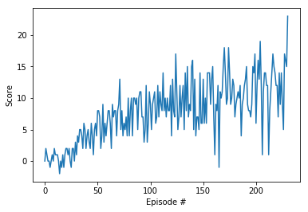
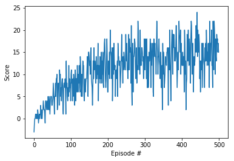

This details the methodology used in evaluating and improving agent learning performance.

### Algorithm

This agent implements the Deep Q Network (DQN) algorithm. Reinforcement learning is unstable or divergent when a nonlinear function approximator such as a neural network is used to represent Q. This instability comes from the correlations present in the sequence of observations, the fact that small updates to Q may significantly change the policy and the data distribution, and the correlations between Q and the target values.

The technique used experience replay, a biologically inspired mechanism that uses a random sample of prior actions instead of the most recent action to proceed. This removes correlations in the observation sequence and smooths changes in the data distribution. Iterative update adjusts Q towards target values that are only periodically updated, further reducing correlations with the target([Source])(https://en.wikipedia.org/wiki/Q-learning#Deep_Q-learning). More details are available in the original DQN [paper](https://deepmind.com/research/dqn/).


### Neural Network Model

The neural network model maps the state (input) to actions (output). It consists of a two fully connected hidden layers, each with 32 nodes and using relu activation. Networks with one, two and three hidden layers were all tested and two was found to work best. The number of nodes in the hidden layers was tried with 16, 32 and 64, and 32 was found to work best.

- Fully connected layer - input: 37 (state size) output: 32
- Fully connected layer - input: 32 output 32
- Fully connected layer - input: 32 output: 4 (action size)

Parameters used in DQN algorithm:

- Maximum steps per episode: 1000
- Starting epsilion: 1.0
- Ending epsilion: 0.01
- Epsilion decay rate: 0.99

Tweaking epsilon was the other hyperparameter that was found to improve learning speed. I trained the agent with Epsilion decay rate of 0.995 and it took around 800 episodes to score +15. But reducing the Epsilion decay rate to 0.99 helped agent learn faster.


### Results


```
Episode 100	Average Score: 7.40
Episode 200	Average Score: 12.40
Episode 231	Average Score: 15.20
Environment solved in 131 episodes!	Average Score: 15.20
```

Observation: It took 131 episodes to train an agent to score +15 in consecutive 100 episodes with epsilon decay rate of 0.99. But with same epsilon decay rate, it took more than 500 episodes to score +20.



###  Summary and Future work

By changing the epsilon decay rate, agent learned significantly fast. The lower the epsilon decay rate, the faster it is the solution.  However, higher fluctuation of average score is also observed.

To pick up more yellow bananas and achieve higher score, I suggest using a convolutional neural network DQN with Learning from pixels. The other DQN models mentioned in the course are potentially better learning algorithms especially when state spaces increases and the training ground gets more complicated. 

In future I would like to try below enhancements to further improve the performance of the agent, also I would like to experiment with other Unity ML agent environments.

- Double Deep Q-learning
- Dueling Deep Q-learning
- Prioritized Experience Replay Deep Q-learning
- A rainbow combination of Deep Q-learning algorithms
- Trying different loss functions, optimizers and learning rate.

